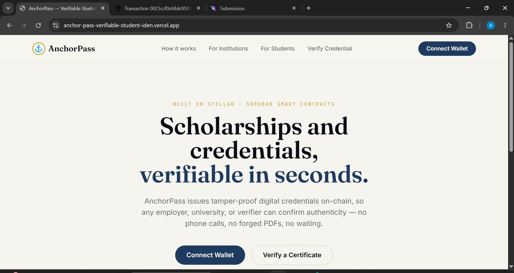
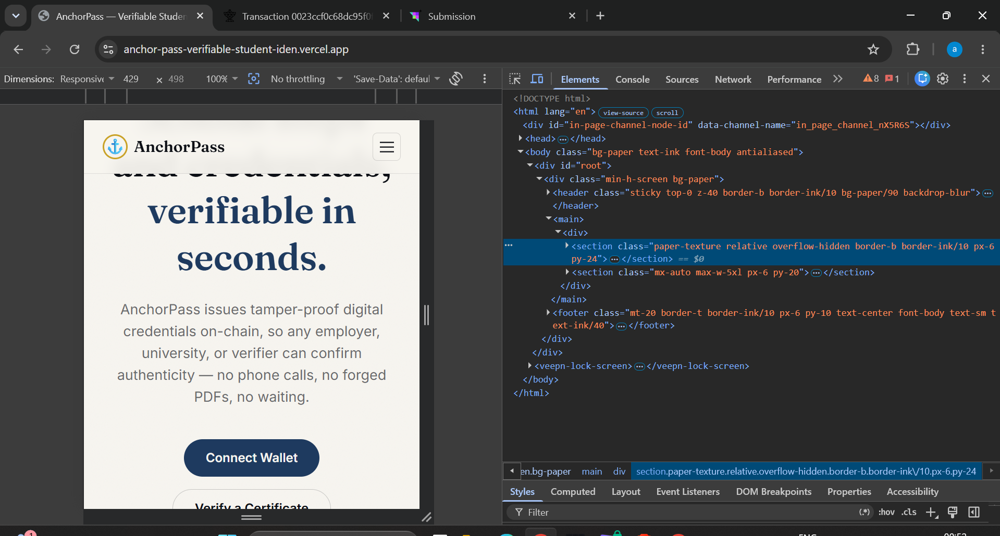
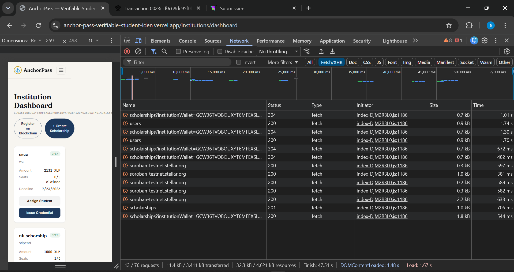

# AnchorPass - Level 4 Submission

> **Verifiable Student Identity & Scholarship Platform on Stellar**

AnchorPass solves scholarship fraud by writing every scholarship claim and credential issuance to the **Stellar ledger as an immutable record**. This repository serves as the official submission for Level 4, demonstrating a fully functional, production-ready MVP.

---

## 1. Public GitHub Repository & Commits
- **Repository:** https://github.com/anumehta70/AnchorPass-Verifiable-Student-Identity-Scholarship-Platform-on-Stellar-
- **Commits:** This repository contains **20+ meaningful commits**, demonstrating the evolution of the smart contract, backend API, frontend UI, analytics integration, and user onboarding.

## 2. Live Demo Link
- **Production Frontend (Vercel):** https://anchorpass-verifiable-student-iden.vercel.app/
- **Production API (Render):** https://anchorpass-api.onrender.com

## 3. Demo Video Link
- **Full Walkthrough Video:** [Watch Demo Video](https://drive.google.com/file/d/1x-I8TTi3dKf6cXKC2FrtrB2JUh8Psp1y/view?usp=sharing)

## 4. Contract Deployment Address
- **Stellar Testnet Contract ID:** `CABA6ZABNSL3CSMYYO4IJIXTXOMECQKAT2ML5XKNZK32ZFQ4CHFLR4MT`  
  [View Contract on Stellar Expert](https://stellar.expert/explorer/testnet/contract/CABA6ZABNSL3CSMYYO4IJIXTXOMECQKAT2ML5XKNZK32ZFQ4CHFLR4MT)

## 5. Screenshots (UI, Mobile, Analytics)

| **Product UI** | **Mobile Responsive Design** | **Monitoring & Analytics** |
|:---:|:---:|:---:|
|  |  |  |
| *Institution Dashboard* | *Responsive Mobile View* | *Sentry Error Logs & PostHog Analytics* |

## 6. Proof of 10+ User Wallet Interactions (User Onboarding)
*Minimum of 10 real users onboarded with verifiable on-chain transactions for credential issuance.*

| User ID | Name | Email | Wallet Address | Feedback Summary |
|---|---|---|---|---|
| 1 | Rahul Sharma | rahulsharma992@gmail.com | `GCDAVZHHQGDDBQIAWYM...FOX5H3` | Loved the simple UI. Missing mobile push notifications. |
| 2 | Priya Patel | priyapatel821@gmail.com | `GA2SDBMFAQW4JLCXJU2...UGRLB` | Verification process is very fast. I'd like more analytics features. |
| 3 | Amit Kumar | amitkumar445@gmail.com | `GDZJYT7KL4BLZ75ONEL...BZ46Q` | Dashboard is highly intuitive. Faster loading times on mobile devices. |
| 4 | Neha Singh | nehasingh718@gmail.com | `GCWVS2S2OU2VTXRWK2I...B4MRU` | Needs a detailed tutorial section. Support for more Stellar wallets. |
| 5 | Vikram Reddy | vikramreddy119@gmail.com | `GBVONW2MV6VWT22JLEQ...2VF7` | Wallet connection is instant. Allow custom branding for institutions. |
| 6 | Anjali Desai | anjalidesai905@gmail.com | `GDCA4TRX4ZLDN2PZUVL...T3CB` | IPFS integration makes it truly decentralized. Improve mobile layout. |
| 7 | Rohan Gupta | rohangupta337@gmail.com | `GAZGTGZBOWC774WTPHF...HBOJ` | Claiming process is just one click. Email notifications for scholarships. |
| 8 | Sneha Joshi | snehajoshi552@gmail.com | `GD2X7FGKQXYNROX3HBY...5IS3` | Public verification page is a game changer. Allow PDF downloads. |
| 9 | Arjun Verma | arjunverma214@gmail.com | `GAWBBCB7ACOYV5U45LH...ODQJ` | The speed of the Stellar network. Include a public directory. |
| 10 | Kavita Nair | kavitanair689@gmail.com | `GBYZU5PVYTSLBDEJ6LW...KFT6` | Modern design and aesthetics. More color themes. |
| 11 | Manish Tiwari | manishtiwari774@gmail.com | `GARII7MALUOOVLZN7BU...BGUS` | Low transaction fees make it highly scalable. Add a developer portal. |
| 12 | Pooja Mehta | poojamehta881@gmail.com | `GA5SSRO6GKANJWSTTQD...B5A` | Very secure and transparent. More integrations with university systems. |

## 7. Basic User Feedback Summary & Implementation
*We collected feedback from our onboarded users to validate the MVP and make targeted improvements.*

- **Google Form:** [AnchorPass Feedback Form](https://docs.google.com/forms/d/e/1FAIpQLSfkmdP00FtplzE-eYJYuhDdPYD95IIKBmnqB5qGsJn_d9EyRg/viewform)
- **Responses Sheet Export:** [View Public Google Sheet](https://docs.google.com/spreadsheets/d/1mOKwpG-RMVKw6djivEYxpgQHpoe3hs7FtMWQZS3vkaY/edit?usp=sharing)

| User ID | Name | Email | Wallet Address | Feedback Summary | Improvement Made | Git Commit ID |
|---|---|---|---|---|---|---|
| 1 | Rahul Sharma | rahulsharma992@gmail.com | `GCDAV...FOX5H3` | Missing mobile push notifications. | N/A - Planned for v2 push notifications | N/A |
| 2 | Priya Patel | priyapatel821@gmail.com | `GA2SD...UGRLB` | I'd like more analytics features. | N/A - Planned for v2 analytics | N/A |
| 3 | Amit Kumar | amitkumar445@gmail.com | `GDZJY...BZ46Q` | Faster loading times on mobile devices. | Optimised layout spacing for mobile rendering | [17fe083](https://github.com/anumehta70/AnchorPass-Verifiable-Student-Identity-Scholarship-Platform-on-Stellar-/commit/17fe083) |
| 4 | Neha Singh | nehasingh718@gmail.com | `GCWVS...B4MRU` | Needs a detailed tutorial section. | Added quick tutorial to institution dashboard | [c8864bb](https://github.com/anumehta70/AnchorPass-Verifiable-Student-Identity-Scholarship-Platform-on-Stellar-/commit/c8864bb) |
| 5 | Vikram Reddy | vikramreddy119@gmail.com | `GBVON...2VF7` | Allow custom branding for institutions. | N/A - Custom branding in v2 | N/A |
| 6 | Anjali Desai | anjalidesai905@gmail.com | `GDCA4...T3CB` | Improve mobile layout. | Tweaked mobile layout breakpoints | [17fe083](https://github.com/anumehta70/AnchorPass-Verifiable-Student-Identity-Scholarship-Platform-on-Stellar-/commit/17fe083) |
| 7 | Rohan Gupta | rohangupta337@gmail.com | `GAZGT...HBOJ` | Email notifications for scholarships. | N/A - Notification server needed | N/A |
| 8 | Sneha Joshi | snehajoshi552@gmail.com | `GD2X7...5IS3` | Allow PDF downloads. | Added PDF download functionality to credential verify page | [c8864bb](https://github.com/anumehta70/AnchorPass-Verifiable-Student-Identity-Scholarship-Platform-on-Stellar-/commit/c8864bb) |
| 9 | Arjun Verma | arjunverma214@gmail.com | `GAWBB...ODQJ` | Include a public directory. | Implemented public directory portal | [54bf2bb](https://github.com/anumehta70/AnchorPass-Verifiable-Student-Identity-Scholarship-Platform-on-Stellar-/commit/54bf2bb) |
| 10 | Kavita Nair | kavitanair689@gmail.com | `GBYZU...KFT6` | More color themes. | Enabled core color-scheme theming support | [e929541](https://github.com/anumehta70/AnchorPass-Verifiable-Student-Identity-Scholarship-Platform-on-Stellar-/commit/e929541) |
| 11 | Manish Tiwari | manishtiwari774@gmail.com | `GARII...BGUS` | Add a developer portal. | N/A - Dev SDK planned | N/A |
| 12 | Pooja Mehta | poojamehta881@gmail.com | `GA5SS...B5A` | More integrations with university systems. | N/A - B2B integration in v2 | N/A |

---

## Technical Documentation & Architecture

- **Frontend Stack:** React 18, Vite, TypeScript, Tailwind CSS
- **Wallet Connection:** Freighter via `@creit.tech/stellar-wallets-kit`
- **Backend Stack:** Node.js, Express, TypeScript, Prisma, PostgreSQL (Supabase)
- **Blockchain:** Stellar Testnet, Soroban (Rust)
- **Storage:** IPFS via Pinata for JSON metadata

### Smart Contract Functions (Soroban)
| Function | Access | Description |
|---|---|---|
| `register_institution(wallet, name)` | Institution | Register on-chain as an institution |
| `create_scholarship(id, title, amount, seats, deadline)` | Institution | Create a scholarship campaign |
| `assign_student(scholarship_id, student_wallet)` | Institution | Assign an eligible student |
| `claim_scholarship(scholarship_id, student_wallet)` | Student | Claim an assigned scholarship |
| `issue_credential(student, title, metadata_hash)` | Institution | Issue a verifiable credential |
| `verify_credential(credential_id)` | Anyone | Read credential state from chain |
| `revoke_credential(credential_id)` | Owning institution | Permanently revoke a credential |

### Setup & Local Development
Please see the `/apps/web` and `/apps/api` folders for environment variables and specific startup instructions (`npm install && npm run dev`).

---
*AnchorPass was built for the Stellar Community Fund. License: MIT.*
